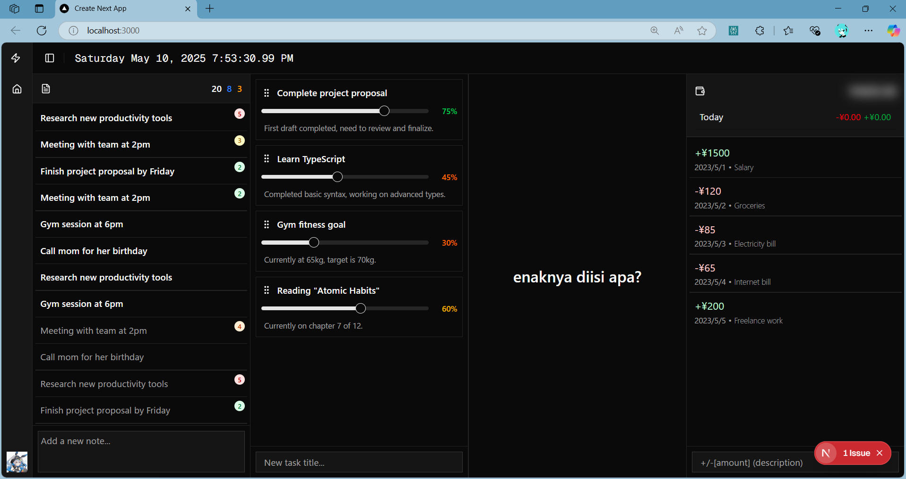

# Life Dashboard



A comprehensive personal dashboard application built with Next.js that helps you organize your life and track your progress across multiple areas.

## Overview

Life Dashboard is a modern web application designed to centralize important aspects of your daily life. It features several widgets to help you stay organized, track your tasks, manage your finances, and monitor your progress towards goals.

## Features

-   **Notes**: Quickly jot down important information, create to-dos, and organize them by priority
-   **Progress Tracker**: Track your progress on various goals and projects with a visual progress bar
-   **Clock**: Real-time clock with date display
-   **Cash Flow**: Monitor your financial activities
-   **Responsive Layout**: Resizable panels allow for customization of your dashboard view

## Tech Stack

-   [Next.js](https://nextjs.org/) - React framework for building the application
-   [React](https://reactjs.org/) - JavaScript library for building user interfaces
-   [Radix UI](https://www.radix-ui.com/) - Unstyled, accessible UI components
-   [Tailwind CSS](https://tailwindcss.com/) - Utility-first CSS framework
-   [Hello Pangea DnD](https://github.com/hello-pangea/dnd) - Beautiful drag and drop for lists
-   [Lucide React](https://lucide.dev/) - Icon set for the interface

## Getting Started

### Prerequisites

-   Node.js (v16 or newer)
-   npm or yarn

### Installation

1. Clone the repository

```bash
git clone https://github.com/yourusername/life-dashboard.git
cd life-dashboard
```

2. Install dependencies

```bash
npm install
# or
yarn
```

3. Run the development server

```bash
npm run dev
# or
yarn dev
```

4. Open [http://localhost:3000](http://localhost:3000) with your browser to see the result.

## Development

This project uses Next.js with App Router and TypeScript. The main components are organized in the `/components` directory, with UI components in `/components/ui`.

### Project Structure

-   `/app` - Next.js app router pages
-   `/components` - React components
    -   `/-*.tsx` - Dashboard widget components
    -   `/ui` - Reusable UI components
-   `/public` - Static assets

## License

[MIT](LICENSE)
